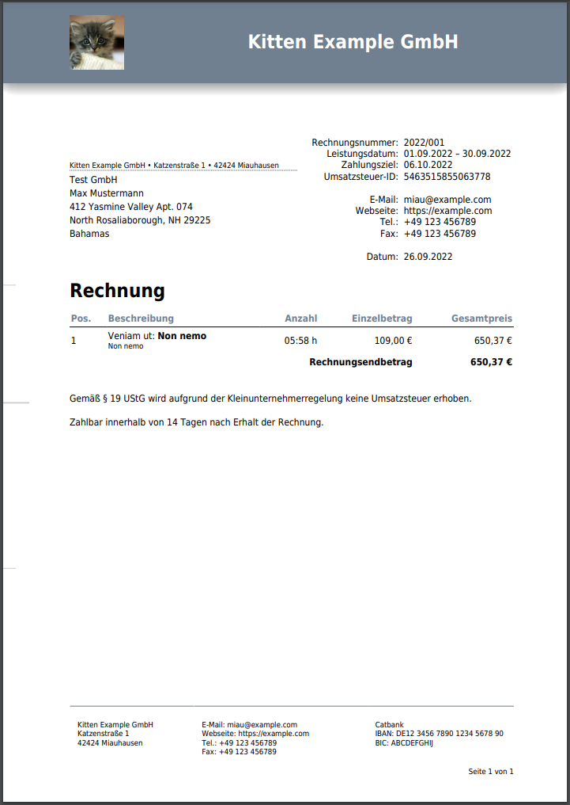

# DIN 5008 invoice template
This template tries to match the requirements of the DIN 5008 norm.



## Customization
You can customize this template by overriding it to change variables and overriding blocks.

### Variables
In your template you can change variables to adjust this template to your needs.
Below is a list of possible variables with a brief explanation of their function.

Example for overriding a varialbe:
```twig




```

#### `logoUrl`
Sets url of the header logo.

#### `accentColor`
Sets color for header background, table header font color and the color of the footer separator line.

#### `fontFamily`
Sets the used font family of the invoice. Please make sure that the font is available for mpdf. Refer to the officail [Kimai documentation](https://www.kimai.org/documentation/invoices.html#custom-fonts) for more information.

#### `introductionText`
Sets an introduction text that is displayed before the invoice positions.

#### `invoiceSenderAddress`
Sets the sender address that is displayed in the address window.

#### `showFoldHoleMarks`
Set if fold and hole marks are printed

### Blocks
If you need more advanced customization you can override the used blocks.

Example:

```twig



    {{ parent() }}
    <style type="text/css">
        .header {
            border-bottom: 5px solid #fff;
        }
    </style>


```
