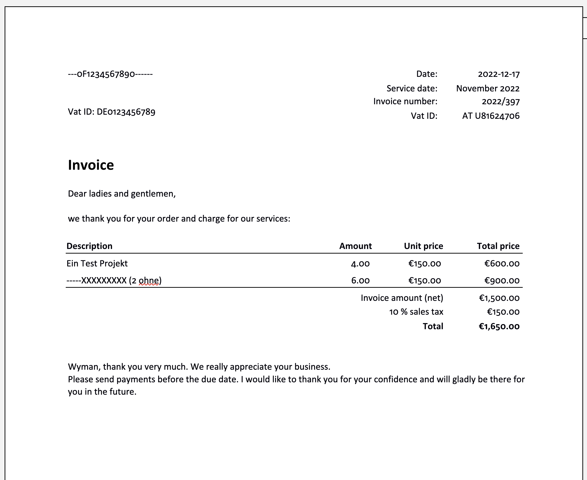

# Docx - Word OOXML

Back to [main page](https://github.com/kimai/invoice-templates).

## Introduction

In Kimai 2.x this "company invoice" was shipped as default DOCX template.  
As it is not auto-translatable by Kimai, it was put here to collect community translations.

List of existing translations: 

- [English](company-en.docx)

