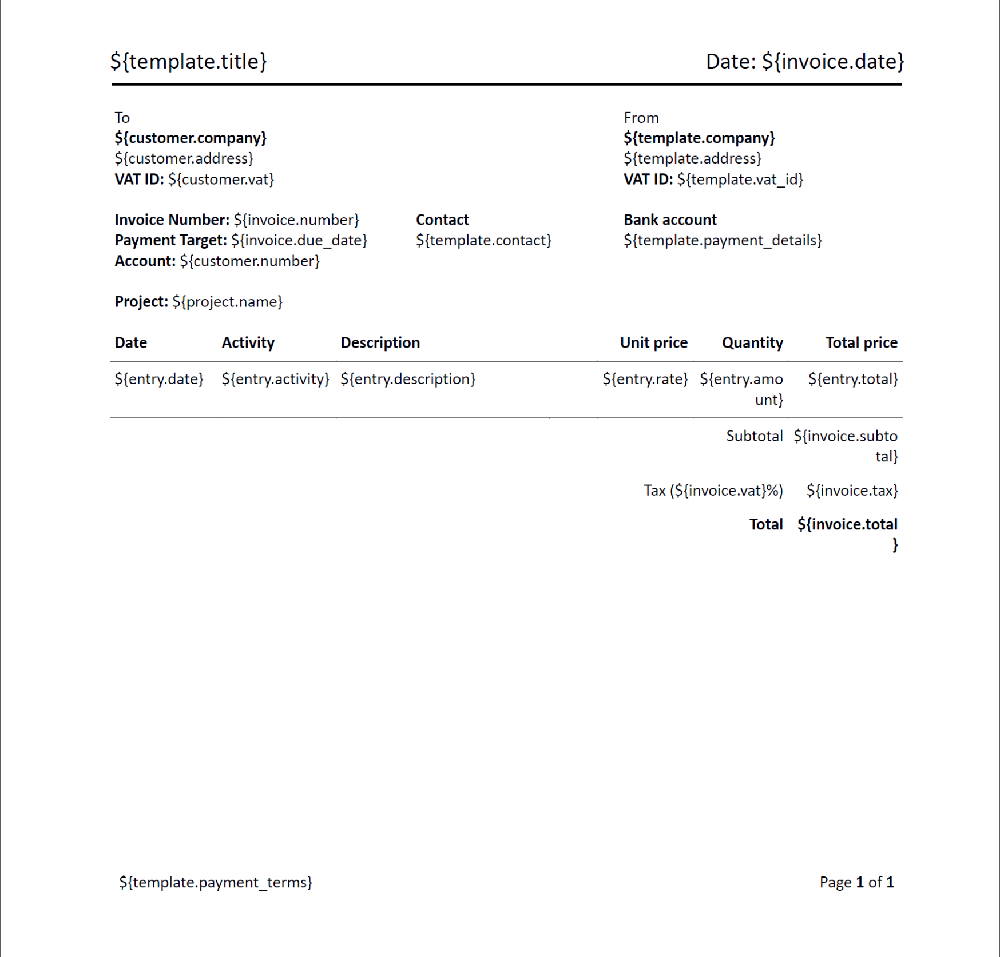

# Docx - Project

Back to [main page](https://github.com/kimai/invoice-templates).

## Introduction

This template was created with the idea to closely resemble the default PDF template, 
but allowing further customization if needed.

The template is suitable for freelancers or small companies that need to invoice per project and to 
show activities.

List of existing translations: 

- [English](project-en.docx)

### Screenshot

